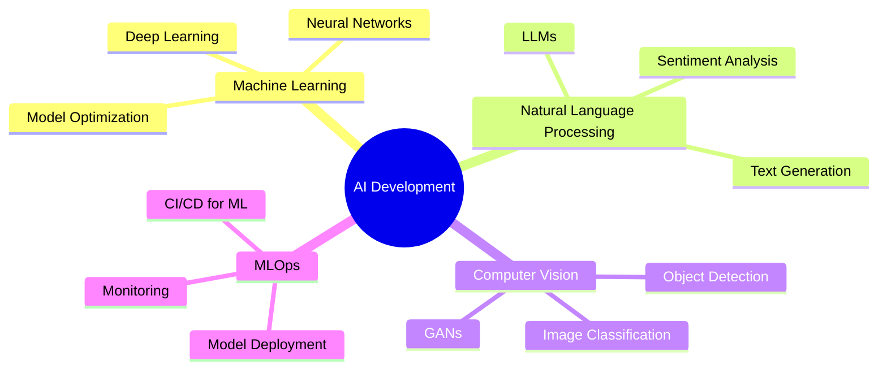

<div align="center">

# 👋 Hello, I'm Anthukuri Shruthi

### 🤖 AI Native Developer | Machine Learning Enthusiast | Tech Innovator

[](https://git.io/typing-svg)

</div>

---

## 🧠 About Me

I'm a passionate **AI-native developer** who believes in leveraging artificial intelligence to solve real-world problems. My journey in tech is driven by curiosity, innovation, and the desire to build intelligent systems that make a difference.

```python
class AnthukuriShruthi:
    def __init__(self):
        self.name = "Anthukuri Shruthi"
        self.role = "AI/ML Engineer"
        self.language_spoken = ["en_US", "hi_IN", "te_IN"]
        self.current_focus = ["Deep Learning", "NLP", "Computer Vision"]
        
    def say_hi(self):
        print("Thanks for dropping by! Let's build something amazing together.")

me = AnthukuriShruthi()
me.say_hi()
```

---

## 🚀 Tech Stack

### 🤖 AI/ML & Data Science


### 💻 Development


### ☁️ Cloud & Tools


---

## 📊 GitHub Stats

<div align="center">
  
[](https://github.com/AnthukuriShruthi)

[](https://github.com/AnthukuriShruthi)

[](https://github.com/AnthukuriShruthi)

</div>

---

## 🎯 Current Focus



---

## 🏆 Achievements & Highlights

- 🎓 **AI/ML Certifications** - Continuously learning and upgrading skills
- 🚀 **Open Source Contributor** - Contributing to AI/ML projects
- 💡 **Problem Solver** - Building intelligent solutions
- 🌟 **Innovation Driven** - Exploring cutting-edge technologies

---

## 📈 GitHub Trophies

<div align="center">
  
[](https://github.com/AnthukuriShruthi)

</div>

---

## 🔥 Featured Projects

### 🤖 AI/ML Projects

<table>
<tr>
<td width="50%">

#### 🧠 [Project Name 1]
Advanced machine learning model for predictive analytics
- **Tech**: Python, TensorFlow, Scikit-learn
- **Highlights**: 95% accuracy, real-time predictions

</td>
<td width="50%">

#### 🎯 [Project Name 2]
Natural Language Processing application
- **Tech**: PyTorch, Transformers, FastAPI
- **Highlights**: BERT-based model, REST API

</td>
</tr>

<tr>
<td width="50%">

#### 👁️ [Project Name 3]
Computer Vision system for object detection
- **Tech**: OpenCV, YOLO, Python
- **Highlights**: Real-time detection, 30+ FPS

</td>
<td width="50%">

#### 🚀 [Project Name 4]
Full-stack AI-powered web application
- **Tech**: React, Node.js, TensorFlow.js
- **Highlights**: Interactive ML models in browser

</td>
</tr>
</table>

---

## 💭 Latest Blog Posts

<!-- BLOG-POST-LIST:START -->
- 🤖 Understanding Transformer Architecture
- 🧠 Fine-tuning Large Language Models
- 🎯 MLOps Best Practices in 2024
- 💡 Building AI-Native Applications
<!-- BLOG-POST-LIST:END -->

---

## 🤝 Let's Connect

<div align="center">

[](https://linkedin.com/in/anthukuri-shruthi)
[](https://twitter.com/anthukuri_shruthi)
[](mailto:anthukuri.shruthi@gmail.com)
[](https://anthukurishruthi.dev)
[](https://medium.com/@anthukuri-shruthi)

</div>

---

## 💡 Random Dev Quote

<div align="center">

[](https://github.com/piyushsuthar/github-readme-quotes)

</div>

---

## 📊 WakaTime Stats

<!--START_SECTION:waka-->
<!--END_SECTION:waka-->

---

<div align="center">

### 💬 "Artificial Intelligence is the new electricity" - Andrew Ng

[](https://visitcount.itsvg.in)

⭐️ From [Anthukuri Shruthi](https://github.com/AnthukuriShruthi)

</div>

---

<details>
<summary>📝 More About Me</summary>

### 🎓 Education & Learning
- Constantly exploring new AI/ML technologies
- Active in tech communities and hackathons
- Regular contributor to AI research discussions

### 🌱 Currently Learning
- Advanced Deep Learning Architectures
- Large Language Model Fine-tuning
- MLOps and Model Deployment at Scale
- Generative AI Applications

### 💼 Open for Collaboration
- AI/ML research projects
- Open source contributions
- Innovative tech solutions
- Mentoring opportunities

### 🎯 2025 Goals
- [ ] Contribute to major AI/ML open source projects
- [ ] Publish research papers
- [ ] Build production-grade AI applications
- [ ] Mentor aspiring AI developers
- [ ] Complete advanced ML certifications

</details>

---

<div align="center">

### 🚀 Let's build the future together!

**If you find my work interesting, consider giving a ⭐ to my repositories!**

</div>
